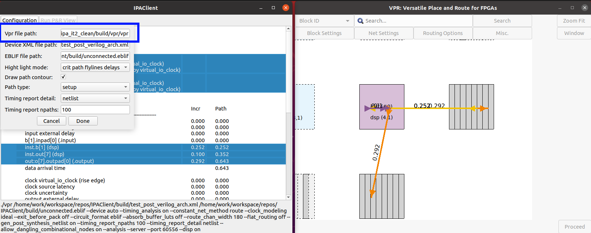

# IPAClient

## Overview
Simple IPA Client Viewer to test [vpr](https://github.com/verilog-to-routing/vtr-verilog-to-routing/tree/master/vpr) server functionality.

### Prerequisites
- CMake 3.5 or higher
- C++17 compatible compiler
- Qt5 or Qt6

### Tested
- ubuntu 20.04

- Qt5 (!!! not tested with Qt6)

### Building the Project
1. Clone the repository:
```sh
git clone git@github.com:w0lek/IPAClient.git
cd IPAClient
```

2. Create a build directory and navigate into it:
```sh
mkdir build
cd build
```

3. Run CMake to configure the project:
```sh
cmake ..
```

4. Build the project:
```sh
cmake --build .
```

### Running the Application

After building, you can run the application with:

```sh
./IPAClient
```
### Minimal viable configuration
In App window, press [Configuration] button and setup valid vpr binary file path as shown in the picture


**Note:**
The IPAClient will runs server internally, so user don't have to deal with manual vpr instance running in server mode.
